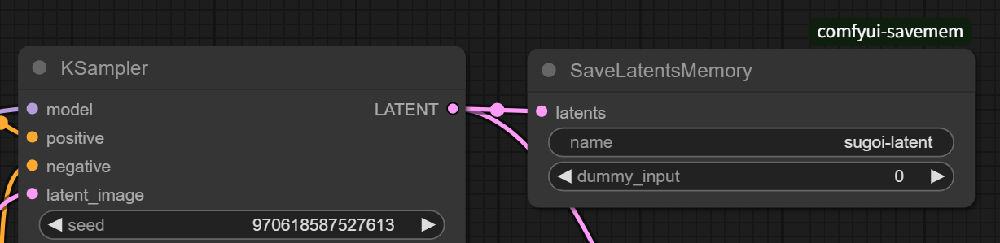

# ComfyUI-SaveMem - Save Image/Latent to Shared Memory

[日本語 ver.](./README_ja.md)

A custom node for ComfyUI that writes images and latents to shared memory (`multiprocessing.shared_memory.SharedMemory`).

This is intended for use via API.

The nodes are added under `hnmr/image` and `hnmr/latent`.

## Nodes

### SaveImagesMemory


Receives images (multiple images are also supported) and writes them as PNG format binary to the shared memory with the specified name.

| in/out | name | type | Description |
| --- | --- |--- | --- |
| in | name | STRING | Name of the shared memory to write to |
| in [opt] | dummy_input | INT | Dummy argument to force redrawing |

Please create the destination shared memory on the receiver side in advance.

Memory format:
```
- 4 bytes: Number of images
- 4n bytes: Length of each image binary
- rest: Binary data of each image
```

Each values are stored in native endian.

### SaveLatentsMemory



Receives latent of any shape and writes it to the specified shared memory using `torch.save`.

| in/out | name | type | Description |
| --- | --- |--- | --- |
| in | name | STRING | Name of the shared memory to write to |
| in [opt] | dummy_input | INT | Dummy argument to force redrawing |

Memory format:
```
- 8 bytes: Length of following binary
- rest: Binary data
```

Each values are stored in native endian.
