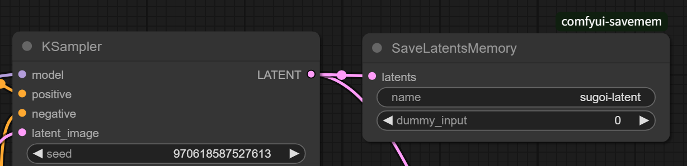

# ComfyUI-SaveMem - Save Image/Latent to Shared Memory

[English ver.](./README.md)

ComfyUI で画像と latent を共有メモリ (`multiprocessing.shared_memory.SharedMemory`) に書き出すカスタムノードです。

API経由での利用を想定しています。

ノードは `hnmr/image` および `hnmr/latent` 以下に追加されます。

## Nodes

### SaveImagesMemory


画像（複数枚も可）を受け取り、指定された名前の共有メモリに PNG 形式のバイナリを書き出します。

| in/out | name | type | Description |
| --- | --- |--- | --- |
| in | name | STRING | 書き出し先の共有メモリの名前 |
| in [opt] | dummy_input | INT | 強制的に再描画するためのダミー引数 |

書き出し先の共有メモリは受け手側で作っておいてください。

メモリフォーマット：
```
- 4 bytes: 画像の枚数
- 4n bytes: 各画像のバイナリの長さ
- rest: 各画像のバイナリ
```

数値はネイティブエンディアンで記録されます。

### SaveLatentsMemory



任意形状の latent を受け取り、指定された名前の共有メモリに `torch.save` で書き出します。

| in/out | name | type | Description |
| --- | --- |--- | --- |
| in | name | STRING | 書き出し先の共有メモリの名前 |
| in [opt] | dummy_input | INT | 強制的に再描画するためのダミー引数 |

メモリフォーマット：
```
- 8 bytes: latent のバイナリのサイズ
- rest: torch.save した latent のバイナリ
```

数値はネイティブエンディアンで記録されます。
